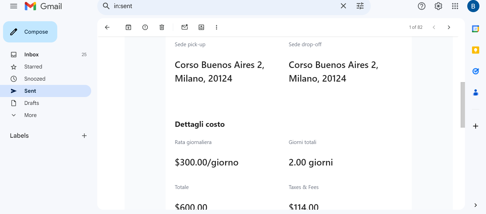
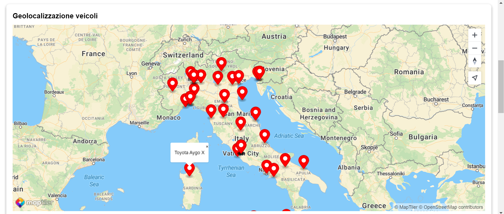

<h1 align="center">

</h1>

## About The Project

This repository contains the website developed to manage the rentals of a car rental company, created as part of a school project. The company uses a satellite geolocation system to track the real-time position of all rented cars and vehicles.

Users can rent vehicles by registering on the company's website. During registration, users enter their credit card information and await authorization through a One Time Password (OTP). Once authorized, the vehicle is rented, and a certain amount is blocked, which will be accounted for upon the vehicle's return.

The company has multiple locations, allowing users to pick up the vehicle in the nearest town or city. The system must manage the reservation in real-time and send the user a summary email confirming the reservation.

<br />
<p align="center">

&nbsp;

</p>

<p align="center">

&nbsp;

</p>

## Features

<details close>
<summary>
Login and Registration with JWT for Authentication
</summary> 
<br />
  
The website includes login and registration functionalities for users, utilizing JSON Web Tokens (JWT) for secure authentication. This ensures that only authorized users can access and manage their bookings. 

When a user registers, they must provide personal information. Once the registration is complete, a JWT token is generated and sent to the user for access. During the login process, the user enters their credentials, such as email and password. If the credentials are correct, the server generates a JWT token and sends it to the user. 

Whenever the user makes a request to the server, such as viewing their bookings or renting a vehicle, the JWT token is sent with the request. This token is used to verify the user's identity. The server validates the token, and if it is valid, authorizes the requested operation, thereby ensuring a high level of security in transactions and booking management.

<p align="center">

</p>
</details>

<details close>
<summary>
Map with Company Locations
</summary> 
<br />
  
The website includes an interactive map that displays all the locations of the car rental company, allowing users to easily find the nearest location. This map has been created using the MapTiler API, which offers a robust and flexible solution for integrating maps into websites.

Users can view the map directly on the website, where each location is marked with a pin. Clicking on a pin displays detailed information about the location, such as the address, phone number, and opening hours. This makes it simple for users to find and contact the desired location.

The integration with the MapTiler API ensures that the map is always up-to-date and responsive, providing a smooth and intuitive navigation experience. Additionally, the map supports zoom and pan functionalities, allowing users to explore different geographic areas and easily find the most convenient company location for them.

<p align="center">

</p>
</details>

<details close>
<summary>
Vehicle Filters and Search
</summary> 
<br />
  
The website offers a powerful vehicle filters and search functionality, allowing users to easily find the vehicle that best meets their needs. Users can filter available vehicles by various criteria, including make, car type, price, year, mileage, and fuel type.

The search functionality enables users to input one or more filter criteria to narrow down the results. For example, a user can search for a specific car brand, select a vehicle type such as SUV or sedan, set a price range, specify the year of manufacture, maximum mileage, and fuel type (gasoline, diesel, electric, etc.).

This advanced filters and search system significantly enhances the user experience, making it quicker and easier to find the desired vehicle. With this feature, users can view only the vehicles that exactly match their criteria, saving time and simplifying the rental process.

<p align="center">

</p>
</details>

<details close>
<summary>
Favorite Vehicles List
</summary> 
<br />
  
The website includes a feature that allows users to add vehicles to their favorite list. This function enables users to save vehicles they find interesting or wish to rent in the future, making it easier and more convenient to keep track of their preferred options.

After adding a vehicle to their favorites, users can access a dedicated page that displays all the saved vehicles. This page provides an overview of the favorite vehicles, including details such as make, model, price, and other relevant information. Users can remove vehicles from the list or proceed with renting directly from the favorites page.

This feature significantly enhances the user experience, allowing better management of rental options and making informed decisions more efficiently.

<p align="center">

</p>
</details>

<details close>
<summary>
Car Rental with OTP Authentication and Summary Email
</summary> 
<br />
  
The website offers an advanced car rental feature that includes OTP (One-Time Password) authentication and the sending of a summary email after the rental. This process ensures a secure and transparent experience for users.

To rent a car, the user must first enter their payment method details, including the card number, expiration date, and CVV. The user's personal information is auto-filled, but they can always modify it. The user must also specify the rental start and end dates, the desired pickup location, and choose whether to pay immediately or upon vehicle pickup (with a 10% deposit).

Once all the entered information is checked and verified, a 2-minute OTP code is sent to the user's email. After entering the OTP code, it is verified, and then the rental is finalized. Once the rental is completed, a summary email with the rental details is sent to the user, providing confirmation and a record of important information.

<p align="center">

&nbsp;

</p>

<p align="center">

&nbsp;

</p>
</details>

<details close>
<summary>
Administrator Dashboard
</summary> 
<br />
  
The website includes a comprehensive administrator dashboard that enables efficient and detailed management of the car rental business. Through this dashboard, the administrator can access a wide range of information and details about users, rented vehicles, company earnings, and much more.

The dashboard features intuitive charts that enhance data understanding, making it easier to analyze information. There are also detailed tables displaying data on all registered users and all vehicles in the database. These tools allow the administrator to have a complete and updated overview of business activities.

The main feature of the dashboard is the real-time geolocation of rented vehicles. This system allows the administrator to monitor the exact position of each vehicle at any time, enhancing the security and efficiency of the service. Real-time geolocation enables quick intervention in emergencies, route optimization, and better fleet management.

Additionally, the administrator has the ability to add new vehicles to the website by entering all the necessary data. This process is streamlined through a user-friendly interface that guides the administrator through various steps, ensuring all information is entered correctly and completely.

<p align="center">

&nbsp;

</p>

<p align="center">

&nbsp;

</p>
</details>

<details close>
<summary>
User Profile Management
</summary> 
<br />
  
The website offers an advanced user profile management feature that provides a dedicated interface for viewing and editing personal information and rental details. This functionality allows users to have complete control over their bookings and personal data.

On the profile page, users can view their upcoming rentals with the option to modify details such as dates and pickup locations. Additionally, users can access their rental history, which provides an overview of past bookings and associated information.

The profile page also allows users to update their personal information, such as email address, phone number, and payment details. This enables users to keep their information current and manage their future and past rentals easily, enhancing the overall service experience.

<p align="center">

</p>
</details>

## Getting Started

To get a local copy up and running follow these simple steps.

### Prerequisites

<p>Before you start, make sure you have the following prerequisites installed:</p>
<ul>
<li>A code editor to run the project (e.g., Visual Studio Code)</li>
<li>Git</li>
<li> Node.js </li>
</ul>

### Installation

For the project to function correctly, the backend steps must be completed before proceeding with the frontend steps.

<details close>
<summary>
Backend
</summary> 
<br />

This project is compatible with any web server of your choice. However, for demonstration purposes, we recommend using [XAMPP](https://www.apachefriends.org/index.html).

For macOS users, we suggest using [MAMP](https://www.mamp.info/en/).

Remember, you are not limited to XAMPP or MAMP. Feel free to use any web server and database management system that suits your preferences and requirements.

### Inclusion of `.htaccess` File in API Folder

The `.htaccess` file in the API folder contains directives for URL rewriting and setting environment variables for HTTP authorization. Here's a summary of what it does:

- `RewriteEngine On`: Enables the Apache module mod_rewrite for URL rewriting.
- `RewriteCond %{REQUEST_FILENAME} !-f`: Checks if the requested file does not exist.
- `RewriteCond %{REQUEST_FILENAME} !-d`: Checks if the requested directory does not exist.
- `RewriteCond %{REQUEST_FILENAME} !-l`: Checks if the requested resource is not a symbolic link.
- `RewriteRule . index.php [L]`: Redirects all requests to index.php if they do not match an existing file, directory, or symbolic link.

Additionally, the file sets an environment variable `HTTP_AUTHORIZATION` based on the `Authorization` header in the HTTP request.

### Inclusion of `.env` File

The `.env` file in the project contains sensitive information such as database credentials and secret keys. While exposing such information in a public repository, especially on platforms like GitHub, is a significant security risk and considered a bad practice in real-world scenarios, it has been included in this repository for educational purposes. This decision was made to facilitate easier understanding and starting of the project for learners.

However, it is essential to emphasize that users should never follow this bad practice in their personal or official projects. Instead, they should replace the placeholder variables in the `.env` file with their own credentials and secret keys. For example:

`DB_HOST = 'localhost'`
`DB_NAME = 'autonoleggi'`
`DB_USER = 'root'`
`DB_PASS = ''`
`SECRET_KEY = "6A586E3272357538782F413F4428472B4B6250655367566B5970337336763979`

Additionally, users should ensure that the secret key used in their projects is unique and secure. Furthermore, they should never upload sensitive information like secret keys to public repositories, following best practices to maintain the security of their applications.
becuase this for educational purposes, i hae sacrificed myself for your sake winks winks, to get get you started faster, make sure to configure your project if DB and server configurations differs


### Setting Up the Database

#### Step 1: Accessing PHPMyAdmin

1. Open your web browser and navigate to your PHPMyAdmin dashboard. This is typically accessible through your local server's address (e.g., `http://localhost/phpmyadmin`).

#### Step 2: Creating the Database

2. Once logged in to PHPMyAdmin, click on the "Databases" tab in the top navigation menu.

3. In the "Create database" field, enter the name "autonoleggio_itis".

4. Click on the "Create" button to create the database (autonoleggio_itis).

#### Step 3: Importing the SQL File

5. Locate the `autonoleggio_itis.sql` file in the root folder of your project directory, in this case [here](backend/database/autonoleggio_itis.sql).

6. Back in PHPMyAdmin, select the "autonoleggio_itis" database from the left-hand sidebar to ensure it is the active database.

7. Look for the "Import" tab in the top navigation menu.

8. Click on the "Choose file" button, then select the `autonoleggio_itis.sql` file from your computer.

9. Once the file is selected, click on the "Go" or "Import" button to begin importing the SQL file into the database.

#### Step 4: Verifying the Import

10. PHPMyAdmin will display a confirmation message once the import is complete. You should see a list of tables imported from the `autonoleggio_itis.sql` file.

</details>

<details close>
<summary>
Fontend
</summary> <br />
1. To download the project, you can clone the repository using the following command in your terminal:
  
```shell
git clone https://github.com/Halid04/auto-noleggio.git
```
Alternatively, you can download the ZIP file of [the repository from GitHub](https://github.com/Halid04/auto-noleggio) and extract it to your computer. <br /> <br />
2. After downloading the project, navigate to the project directory via the terminal and install all necessary dependencies by running the following command:
```shell
npm install
```
<br />
3. Once the dependencies are installed, you can start the application by running:

```shell
npm run dev
```
The application will then be available at http://localhost:5173.

</details>

## Built With

* [![React][React.js-badge]][React-url]
* [![PHP][PHP-badge]][PHP-url]
* [![MySQL][MySQL-badge]][MySQL-url]
* [![Tailwind CSS][TailwindCSS-badge]][TailwindCSS-url]
* [![Lucide.dev][Lucide.dev-badge]][Lucide.dev-url]
* [![MapTiler][MapTiler-badge]][MapTiler-url]
* [![Chart.js][Chart.js-badge]][Chart.js-url]
* [![PrimeReact][PrimeReact-badge]][PrimeReact-url]

[React.js-badge]: https://img.shields.io/badge/React-61DAFB?style=flat&logo=react&logoColor=black
[PHP-badge]: https://img.shields.io/badge/PHP-777BB4?style=flat&logo=php&logoColor=white
[MySQL-badge]: https://img.shields.io/badge/MySQL-00618A?style=flat&logo=mysql&logoColor=white
[TailwindCSS-badge]: https://img.shields.io/badge/Tailwind_CSS-06B6D4?style=flat&logo=tailwindcss&logoColor=white
[Lucide.dev-badge]: https://img.shields.io/badge/Lucide.dev-000000?style=flat&logo=lucide&logoColor=white
[MapTiler-badge]: https://img.shields.io/badge/MapTiler-006C70?style=flat&logo=maptiler&logoColor=white
[Chart.js-badge]: https://img.shields.io/badge/Chart.js-F5F5F5?style=flat&logo=chart.js&logoColor=000000
[PrimeReact-badge]: https://img.shields.io/badge/PrimeReact-007AD9?style=flat&logo=primereact&logoColor=white

[React-url]: https://reactjs.org/
[PHP-url]: https://www.php.net/
[MySQL-url]: https://www.mysql.com/
[TailwindCSS-url]: https://tailwindcss.com/
[Lucide.dev-url]: https://lucide.dev/
[MapTiler-url]: https://www.maptiler.com/
[Chart.js-url]: https://www.chartjs.org/
[PrimeReact-url]: https://www.primefaces.org/primereact/

## Contributors

[//]: contributor-faces
<a href="https://github.com/Halid04"></a>
<a href="https://github.com/Lovedeep05"></a>
<a href="https://github.com/70624290"></a>
